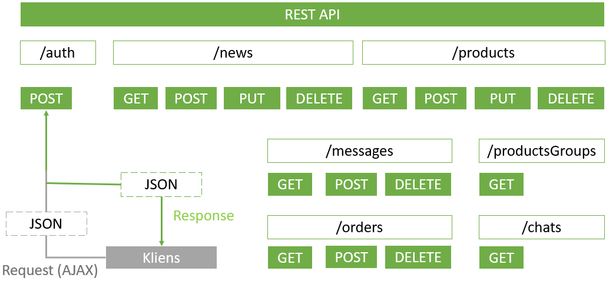

# Kisvállalatokat segítő webáruház Angular keretrendszerben
## Témabejelentő

A cél egy kozmetikai termékeket értékesítő webshop alkalmazás megvalósítása. A weboldal tartalmazna egy vásárlói felületet, amin olyan
mai oldalak elvárt funkcióit tartalmaznának, mint a chat funkció vagy a csomagküldés és fizetési felület választékos kínálata. Ezen felül a
regisztrált felhasználóknak profil oldal biztosítása, amin láthatnák rendeléseiket és kedvelt termékeiket. 
Az oldal kiegészülne egy adminisztrációs felülettel, amin keresztül a tulajdonos könnyedén és felhasználó barát felületen tudná szerkeszteni
a webshop termékeit esetleges akciókat megadni és a híroldal cikkeit frissíteni. Továbbá analitikus szoftver segítségével a tulajdonos
számára részletes statisztikát kapna a weboldal látogatottságáról és egyes oldalak népszerűségéről.
A szakdolgozat magába foglalja az adatbáziskezelést, szerver és kliensoldali fejlesztéseket. A kliensoldal az Angular nevezetű
keretrendszert felhasználásával valósulna meg.
A webalkalmazás végső célja, hogy kisvállalkozásoknak kezdeti felületet biztosítson a termékeik értékesítésére.

## Alkalmazás összefoglaló bemutatása
Az alkalmazás jelen leírás csak összefoglalóként szolgál. A program teljes dokumentált formája megtalálható a Kisvállalatokat_segítő_webáruház_Angular_keretrendszerben.pdf nevezetű PDF kiterjesztésű fájlban.
### Funkcionális követelmények

A webáruház különböző termékek tárolására és árusítására szolgáló alkalmazás. A vásárlót különböző informális eszközök segítik a vásárlás lebonyolításában.
Az alkalmazás rendelkezik egy adminisztrációs felülettel, ahol menedzselhető a webáruház termékek/hírek listája, továbbá megjeleníti a vásárlók által küldött rendeléseket és üzeneteket is. Az admin felületet bejelentkezési oldal előzi meg.

#### Use case diagram

Diagram magyarázó leírása:
- Actor: Az alkalmazás használói és a kapcsolódó eszközök (pl.: hardver vagy egyéb a rendszerrel együttműködő programok)
Az általam készített webáruház 3 actort/szerepkört különböztet meg.
  - Az általános felhasználót, aki az alkalmazáson keresztül böngészi vagy vásárolja a termékeket. 
  - A tulajdonost, akinek admin jogosultsága van, de nem az admin feladatok ellátását szolgálja, hanem az alkalmazásban szereplő adatok naprakészen tartását menedzseli. 
  - Az admint, aki az alkalmazás készítő és a komolyabb rendszer szintű feladatok menedzselése.
- System: A diagramban szereplő használati eseteket összefoglaló jelölés.
- Használati esetek: Az alkalmazásban található funkcionális esetek.
- Relációk: A fentebb leírt eseteket összekötő/összekapcsoló jelölések. A relációk folytonossága, iránya és számossága az adott két végponttól függ.

#### Class diagram

Diagram magyarázó leírása:
A program adatainak tárolása MongoDB alkalmazásával történt. Az alábbi képen látható az adatbázisban található Collections listája

#### Szekvencia diagram
Az alkalmazás vásárlási folyamata bemutatása szekvencia diagram segítségével.

#### Kliensoldal és Szerveroldal kapcsolata
Az adatbázisban tárolt adatok megjelenítése vagy módosítása kliensoldal számára a HttpClient service class és a szerveroldalon található végpontok megadásával érhető el.
A programban használt kommunikációs folyamat megjelenítve az alábbi ábrán látható

#### Végpontok
A föntebbiekben említett szerveroldalon található végpontok listája:

### Alkalmazás bemutatása
Az alkalmazás lényegi funkciók bemutatása a program futása közben mentett képernyőfotók segítségével.
#### Webáruház felülete
A program fejlesztése során a vásárlókat segítő, számos funkció került bele az alkalmazásba. Ilyen segítő funkciók például:
- Chat: a vásárlóban felmerülő kérdések megválaszolása és megjelenításe animáció használatával

- Alert message: a felhasználó által indított kérések folyamatáról informáló üzenetek

- Responsive page: az alkalmazás különböző eszközökön történő helyes megjelenést érdekében

#### Adminisztrációs felület
Az oldal karbantartását és aktualizálását elősegítő felület az admin oldal. A felület bejelentkezését hash metódus segítségével végzem és az új vagy már meglévő adatok
módosítását a bejelentkezés során a szerveroldal által generált token validálásával engedélyeztettem.

