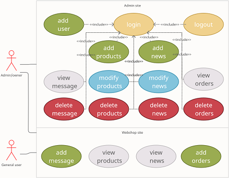

# Kisvállalatokat segítő webáruház Angular keretrendszerben
## Témabejelentő

A cél egy kozmetikai termékeket értékesítő webshop alkalmazás megvalósítása. A weboldal tartalmazna egy vásárlói felületet, amin olyan
mai oldalak elvárt funkcióit tartalmaznának, mint a chat funkció vagy a csomagküldés és fizetési felület választékos kínálata. Ezen felül a
regisztrált felhasználóknak profil oldal biztosítása, amin láthatnák rendeléseiket és kedvelt termékeiket. 
Az oldal kiegészülne egy adminisztrációs felülettel, amin keresztül a tulajdonos könnyedén és felhasználó barát felületen tudná szerkeszteni
a webshop termékeit esetleges akciókat megadni és a híroldal cikkeit frissíteni. Továbbá analitikus szoftver segítségével a tulajdonos
számára részletes statisztikát kapna a weboldal látogatottságáról és egyes oldalak népszerűségéről.
A szakdolgozat magába foglalja az adatbáziskezelést, szerver és kliensoldali fejlesztéseket. A kliensoldal az Angular nevezetű
keretrendszert felhasználásával valósulna meg.
A webalkalmazás végső célja, hogy kisvállalkozásoknak kezdeti felületet biztosítson a termékeik értékesítésére.

## Követelmény leírás

### Funkcionális követelmények

A webáruház különböző termékek tárolására és árusítására szolgáló alkalmazás.

#### Use case diagram

Diagram magyarázó leírása:
- Actor: Az alkalmazás használói és a kapcsolódó eszközök (pl.: hardver vagy egyéb a rendszerrel együtműködő programok)
Az általam készített webáruház 3 aktort/szerepkört különböztet meg.
  - Az általános felhasználót aki az alkalmazáson keresztül böngészi vagy vásárolja a termékeket. 
  - A tulajdonost akinek admini jogosultsága van, de nem az admini feladatok ellátását szolgálja, hanem az alkalmazásban szereplő adatok naprakészen tartását menedzseli. 
  - Az admint aki az alkalmazás készítő és a komolyabb rendszer szintű feladatok menedzselése.
- System: A diagramban szereplő használati eseteket összefoglaló jelölés.
- Használati esetek: Az alkalmazásban található funkcionális esetek.
- Relációk: A fentebb leírt eseteket összekötő/összekapcsoló jelölések. A relációk folytonossága, iránya és számossága az adott két végponttól függ.

